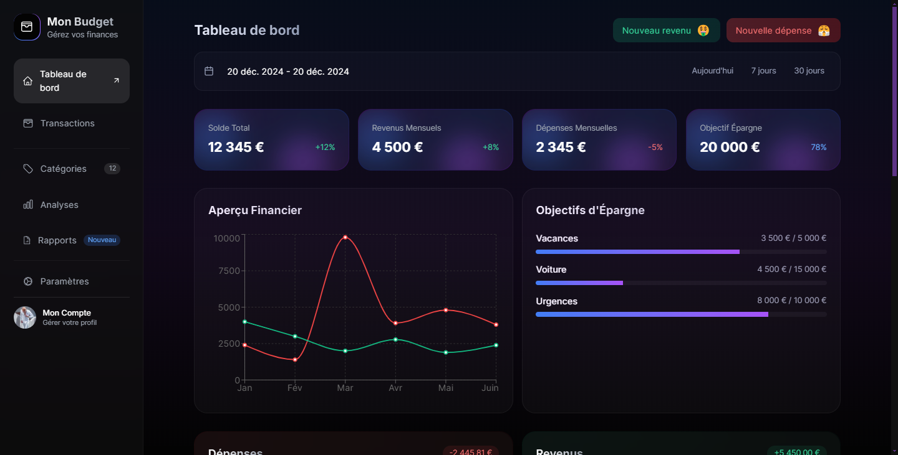

# EXPENSY - Personal Finance Management Template

A modern and intuitive personal finance management application built with Next.js 14, TypeScript, Tailwind CSS, and Clerk Authentication.



## 🌟 Features

- **Modern Authentication** with Clerk  
- **Real-time Dashboard** for financial overview  
- **Transaction Management** with categories  
- **Expense Tracking** and analysis  
- **Responsive Design** for all devices  
- **Dark Mode** by default  
- **Interactive Charts** and statistics  
- **Category Management**  
- **Clean UI/UX** with Tailwind CSS

## 🚀 Tech Stack

- **Framework:** Next.js 14 (App Router)  
- **Language:** TypeScript  
- **Styling:** Tailwind CSS  
- **Authentication:** Clerk  
- **Database:** PostgreSQL with Prisma  
- **Charts:** Recharts  
- **Icons:** Heroicons, Lucide Icons  
- **Deployment:** Vercel

## 📦 Installation

1. Clone the repository:

   ```bash
   git clone https://github.com/kevinkenfack/expensy.git
   ```

2. Install dependencies:

   ```bash
   npm install
   ```
   or
   ```bash
   yarn install
   ```

3. Copy the environment variables:

   ```bash
   cp .env.example .env
   ```

4. Update the environment variables in `.env` with your credentials.

5. Run the development server:

   ```bash
   npm run dev
   ```
   or
   ```bash
   yarn dev
   ```

## 🔧 Configuration

### Environment Variables

Create a `.env` file in the root directory with the following variables:

```env
# Clerk Authentication
NEXT_PUBLIC_CLERK_PUBLISHABLE_KEY=
CLERK_SECRET_KEY=
NEXT_PUBLIC_CLERK_SIGN_IN_URL=/sign-in
NEXT_PUBLIC_CLERK_SIGN_UP_URL=/sign-up
NEXT_PUBLIC_CLERK_AFTER_SIGN_IN_URL=/dashboard
NEXT_PUBLIC_CLERK_AFTER_SIGN_UP_URL=/dashboard

# Database
DATABASE_URL=

# App Config
NEXT_PUBLIC_APP_URL=
```

### Database Setup

1. Set up your PostgreSQL database.
2. Update the `DATABASE_URL` in your `.env` file.
3. Run migrations:

   ```bash
   npx prisma migrate dev
   ```

## 📱 Pages

- `/` - Landing page
- `/dashboard` - Main dashboard
- `/dashboard/transactions` - Transaction management
- `/dashboard/analyses` - Financial analysis
- `/dashboard/settings` - User settings
- `/dashboard/reports` - Financial reports

## 🎨 Customization

### Styling

The template uses Tailwind CSS for styling. You can customize the theme in:

- `tailwind.config.js` - For theme customization
- `app/globals.css` - For global styles

### Components

All reusable components are located in `app/components/`. You can modify them according to your needs.

## 🔐 Authentication

This template uses Clerk for authentication. To customize the authentication flow:

1. Create a Clerk account.
2. Set up your Clerk application.
3. Update the Clerk environment variables.
4. Customize the authentication pages in the Clerk Dashboard.

## 📊 Database Schema

The template includes a basic schema for:

- Users (managed by Clerk)
- Transactions
- Categories

You can extend the schema by modifying `prisma/schema.prisma`.

## 🚀 Deployment

The easiest way to deploy is using Vercel:

1. Push your code to GitHub.
2. Import your repository to Vercel.
3. Add your environment variables.
4. Deploy!

## 📝 License

This project is licensed under the MIT License - see the [LICENSE.md](LICENSE.md) file for details.

## 🤝 Contributing

Contributions are welcome! Please feel free to submit a Pull Request.

## 📧 Support

For support, email your-email@example.com or create an issue in this repository.

## 🙏 Acknowledgments

- [Next.js](https://nextjs.org/)
- [Clerk](https://clerk.dev/)
- [Tailwind CSS](https://tailwindcss.com/)
- [Vercel](https://vercel.com/)

---

Made with ❤️ by [Kevin Kenfack](https://www.kevinkenfack.com/)
